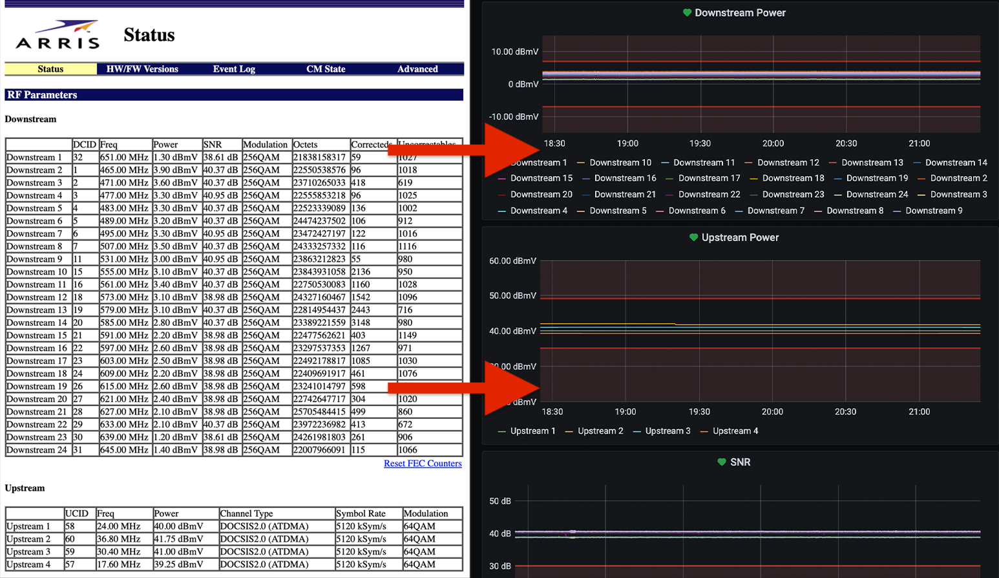

# Arris Scrape

## Overview

A Python script that scrapes an Arris modem status page to insert signal levels into InfluxDB and ultimately Grafana.

The scraper is flexible in that you can subclass pieces to scrape other modems and upload to other databases. With a few tweaks it could be an all-purpose HTML -> Grafana scraper for something entirely unrelated to cable modems!

A preset Grafana dashboard is included with this project with some alerts that monitor the modem's signal levels. The level thresholds were created from the data on [this website](https://pickmymodem.com/signal-levels-docsis-3-03-1-cable-modem/).

- Fields:
  - Downstream
    - SNR
    - DCID
    - Frequency
    - Power
    - Octets
    - Correcteds
    - Uncorrectables
  - Upstream
    - UCID
    - Frequency
    - Power
    - Symbol Rate
- Tags:
  - Downstream ID
  - Modulation (downstream / upstream)
  - Upstream ID
  - Channel Type (upstream)

## Getting Started

1. You must know your modem's IP address. Typically these status pages are accessible from your LAN by going to a URL such as http://192.168.100.1.
2. Hopefully your status page matches the screenshot above. If not, see the section below entitled [Extending](#extending).

### Option A: I already have InfluxDB and Grafana and I want to scrape my modem.

#### First

Copy `config_sample.py` to `config.py` and fill in your modem's URL as well as your InfluxDB hostname. Depending on your InfluxDB configuration, you may need to add more options (e.g. authentication). See the `influxdb.InfluxDBClient` Python module for all possibilities.

#### Python only

1. Follow the instructions above to set up the config file.
2. `pip install -r requirements.txt`
3. `python scrape.py`

#### Docker

1. Follow the instructions above to set up the config file.
2. Install Docker
3. Run `docker-compose build`
4. Run `docker-compose up`

#### Last

Import the included [Grafana JSON](full-service/grafana_dashboards) and tweak appropriately.

### Option B: I don't run InfluxDB or Grafana but I want to scrape my modem, or I want to test drive this project.

1. Install Docker
2. Copy `config_sample.py` to `config.py` and configure the modem URL. Set the host for the InfluxDB section to `influxdb` (`'host': 'influxdb'`).
3. Run `docker-compose -f full-service.yml build`
4. Run `docker-compose -f full-service.yml up`
5. Login to Grafana at http://localhost:3000 with the credentials `admin` / `admin`
6. Open the Modem dashboard.

## Extending

There's a good chance your modem status page doesn't match this one but you want to accomplish the same task. If your modem allows you to see a status page without any authentication but it just has a different layout, then adapting is straightforward. Just clone the `arris_modem.py` target and change the fields and xpath queries as needed. Use the `PrinterOutputter` to see what data points would be uploaded to InfluxDB before doing any real uploading.

If your modem requires some form of authentication, you'll need to implement that part. It may be as straightforward as snooping on HTTP headers using your browser to see what the script needs to send.
